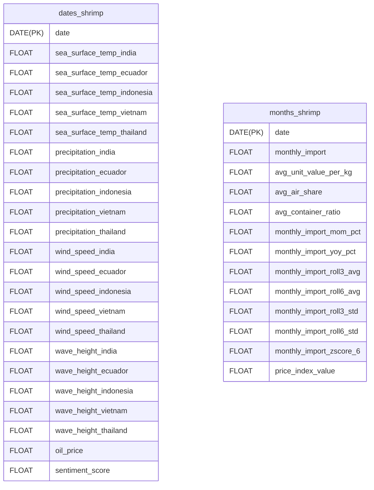

## Schema


## Command
Activate postgres instance
```
docker-compose -f infra/compose.yml --env-file {ENV_LOCATION} up -d
```
- The tables are automatically created once docker instnace is up. Change the schemas in infra/init.sql if needed.

Deactivate postgres instance
```
docker-compose -f infra/compose.yml down -v
```
- No persistent storage yet so deactivating removes all information.
- Must deactivate first for changing schema effects to show.

## Postgres Helper
```services/postgres_helper.py```: A class that provides simplified interactions with postgres. For large data, use dataframe.